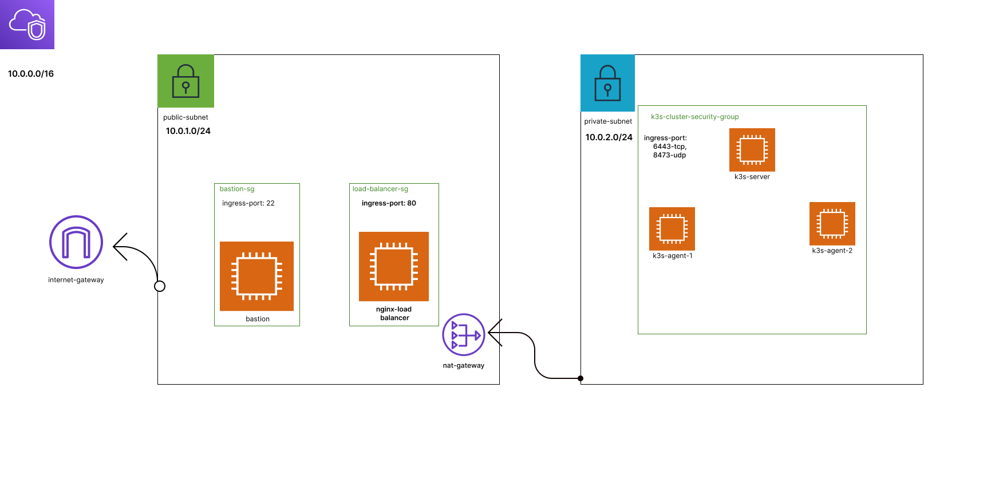

## Create k3s cluster in private subnet and nginx load balancer in public subnet using terraform blueprint approach



# solution: 
we are going to make two module one for "k3s cluster" another for "nginx load balancer".

## folder structure
    > project/dev/                       # development stage code for infra
      -----------config/
      -------------------k3s_manifest/   # For k3s manifest file
      -------------------nginx/          # For nignx load balancer config as  terraform template
    > modules/                           # All modules
      --------k3s-cluster                # Module For k3s cluster
      --------nginx-lb                   # Module For nginx load balancer 


## infra code
``` terraform 
# variables 
variable "k3s_token" {
  type    = string
  default = "e2d2fe05faac243a166d617e9a450ad0"   # demo token ****** change in production ****
}
```
### bastion setup
 bastion server to manage instances.

```terraform
# setup bastion instance


#security group for bastion 

resource "aws_security_group" "bastion_sg" {
  vpc_id = aws_vpc.main.id
  ingress {
    from_port   = 22
    to_port     = 22
    protocol    = "tcp"
    cidr_blocks = ["0.0.0.0/0"]
  }

  egress {
    from_port   = 0
    to_port     = 0
    protocol    = "-1"
    cidr_blocks = ["0.0.0.0/0"]
  }
  tags = {
    Name = "${var.environment}-bastion-sg"
  }

}

locals {

  bastion_user     = "ubuntu"
  private_key_path = "~/.ssh/id_rsa"
}
resource "aws_instance" "bastion" {
  ami                    = local.aws_ami
  subnet_id              = aws_subnet.public_subnet.id
  key_name               = aws_key_pair.kp.key_name
  instance_type          = "t2.micro"
  vpc_security_group_ids = [aws_security_group.bastion_sg.id]

  provisioner "file" {
    source      = local.private_key_path
    destination = "/home/ubuntu/.ssh/id_rsa"


    connection {
      type        = "ssh"
      user        = local.bastion_user
      private_key = file(local.private_key_path)
      host        = self.public_ip
    }
  }
  provisioner "remote-exec" {
    inline = ["chmod 600 /home/ubuntu/.ssh/id_rsa"]
    connection {
      type        = "ssh"
      user        = local.bastion_user
      private_key = file(local.private_key_path)
      host        = self.public_ip
    }
  }
  tags = {
    Name = "${var.environment}-bastion"
  }

}
locals {
  bastion_host = aws_instance.bastion.public_ip
}


```
### k3s cluster module
 setup cluster using "k3s-cluster" module
```terraform
locals {
  k3s_manifest_path = "./config/k3s_manifest/nginx.yaml"
}
module "k3s_cluster" {
  source               = "../../modules/k3s-cluster"
  vpc_id               = aws_vpc.main.id
  environment          = var.environment
  aws_ami              = local.aws_ami
  instance_type        = "t2.micro"
  subnet_id            = aws_subnet.private_subnet.id
  key_name             = aws_key_pair.kp.key_name
  node_count           = 3
  token                = var.k3s_token
  manifest             = file(local.k3s_manifest_path)
  ingress_22_cidr      = aws_subnet.public_subnet.cidr_block
  ingress_app_cidr     = aws_subnet.public_subnet.cidr_block
  ingress_cluster_cidr = aws_subnet.private_subnet.cidr_block
}

locals {
  server_private_ip = module.k3s_cluster.server_ip
}

```
### nginx load balncer
 load balanding k3s workers nodes request using nginx loadbalancer.
 recive request at port 80 and make request to worker node using defualt round-robin 
```terraform
locals {
  server_ip  = module.k3s_cluster.server_ip
  agent_ips  = module.k3s_cluster.agent_ips
  agent_port = 30001
}

module "nginx-lb" {
  depends_on      = [module.k3s_cluster]
  source          = "../../modules/nginx-lb"
  environment     = var.environment
  aws_ami         = local.aws_ami                               # ubuntu ami 
  instance_type   = "t2.micro"
  subnet_id       = aws_subnet.public_subnet.id                 # nginx instance subnet
  vpc_id          = aws_vpc.main.id
  key_name        = aws_key_pair.kp.key_name                    # key to access nginx instance
  ingress_22_cidr = aws_subnet.public_subnet.cidr_block         # only connect using ssh from public subnet instances. ex: bastion
  config = templatefile("./config/nginx/nginx.conf.tftpl", {    
    AppServers = local.agent_ips
    Port       = local.agent_port
  })                                                            # generating config string from  terrafrom template file.
}
```
### output
```terraform
output "bastion" {
  value = aws_instance.bastion.public_ip
}
output "load_balancer_public_ip" {
  value = module.nginx-lb.public_ip
}
output "cluster_server_ip" {
  value = module.k3s_cluster.server_ip
}
output "cluster_agent_ips" {
  value = module.k3s_cluster.agent_ips
}

```


# modules section

## module:   k3s cluster
    notes:
    | Uses 1 server/master and 2 agents/worker

### code
    
```terraform
# variables for k3s cluster module


variable "environment" {
  type    = string
  default = "dev"
}

variable "vpc_id" {
  type = string
}
variable "aws_ami" {
  type = string
}

variable "instance_type" {
  type = string
}
variable "subnet_id" {
}

variable "node_count" {
  type = number
}
variable "key_name" {
  type = string
}
variable "token" {
  type = string
}

variable "manifest" {
  type = string
}
variable "ingress_cluster_cidr" {
  type = string
}
variable "ingress_22_cidr" {
  type = string
}
variable "ingress_app_cidr" {
  type = string
}
```
```terraform
# security group for k3s cluster server and agents 


resource "aws_security_group" "k3s" {
  name        = "${var.environment}-k3s-sg"
  description = "Security group for k3s cluster"
  vpc_id      = var.vpc_id
  ingress {
    from_port   = 30001                               # nodeport 30001
    to_port     = 30001
    protocol    = "tcp"
    cidr_blocks = [var.ingress_app_cidr]
  }
  ingress {
    from_port   = 6443                                # [ Agents ==> Servers ] port 6443: K3s supervisor and Kubernetes API Server 
    to_port     = 6443
    protocol    = "tcp"
    cidr_blocks = [var.ingress_cluster_cidr]
  }
  ingress {
    from_port   = 8472                                # [ All nodes ==> All nodes ] port 8472: Required only for Flannel VXLAN
    to_port     = 8472
    protocol    = "udp"
    cidr_blocks = [var.ingress_cluster_cidr]
  }

  ingress {
    from_port   = 22                                   #port 22: use only for debug purpose
    to_port     = 22
    protocol    = "tcp"
    cidr_blocks = [var.ingress_22_cidr]
  }
  egress {
    from_port   = 0                             
    to_port     = 0
    protocol    = "-1"
    cidr_blocks = ["0.0.0.0/0"]
  }
  tags = {
    Name = "${var.environment}-k3s-sg"
  }
}


```
```terraform
# k3s server/master instance


resource "aws_instance" "k3s_server" {
  ami                    = var.aws_ami
  instance_type          = var.instance_type
  subnet_id              = var.subnet_id
  vpc_security_group_ids = [aws_security_group.k3s.id]
  key_name               = var.key_name
  user_data              = <<-EOF
   #!/bin/bash
    apt update
    curl -sfL https://get.k3s.io | K3S_TOKEN=${var.token} sh -
    echo '${var.manifest}' > /tmp/manifest.yaml
    k3s kubectl apply -f /tmp/manifest.yaml

  EOF
  tags = {
    Name = "${var.environment}-k3s-server"
  }
  lifecycle {
    create_before_destroy = true
  }
}

```
```terraform 
# k3s worker/agents instance


resource "aws_instance" "k3s_worker" {
  depends_on             = [aws_instance.k3s_server]
  count                  = var.node_count - 1
  ami                    = var.aws_ami
  instance_type          = var.instance_type
  subnet_id              = var.subnet_id
  vpc_security_group_ids = [aws_security_group.k3s.id]
  key_name               = var.key_name
  user_data              = <<-EOF
      #!/bin/bash
      apt update
      curl -sfL https://get.k3s.io | K3S_URL=https://${aws_instance.k3s_server.private_ip}:6443 K3S_TOKEN=${var.token} sh -s -
  EOF


  lifecycle {
    create_before_destroy = true
  }

  tags = {
    Name = "${var.environment}-k3s-worker-${count.index + 1}"
  }
}

```
```terraform
# output for k3s cluster module

output "server_ip" {
  value = aws_instance.k3s_server.private_ip
}

output "agent_ips" {
  value = aws_instance.k3s_worker.*.private_ip
}

```


 ## module: nginx load balancer (nginx_lb)
 ### code
```terraform
# variables for nginx load balancer module

variable "environment" {
  type = string
}
variable "vpc_id" {
  type = string
}
variable "aws_ami" {
  type = string
}
variable "instance_type" {
  type = string
}
variable "subnet_id" {
  type = string
}

variable "key_name" {
  type = string
}


variable "config" {
  type = string
}
variable "ingress_22_cidr" {
  type = string
}

```

```terraform
# security group for nginx load balancer


resource "aws_security_group" "nginx-lb" {
  name        = "${var.environment}-nginx-lb-sg"
  description = "Security group for nginx load balander"
  vpc_id      = var.vpc_id

  ingress {
    from_port   = 80                            
    to_port     = 80
    protocol    = "tcp"
    cidr_blocks = ["0.0.0.0/0"]
  }
  ingress {
    from_port   = 22
    to_port     = 22
    protocol    = "tcp"
    cidr_blocks = [var.ingress_22_cidr]
  }
  egress {
    to_port     = 0
    from_port   = 0
    protocol    = "-1"
    cidr_blocks = ["0.0.0.0/0"]

  }
  tags = {
    Name = "${var.environment}-nginx-lb-sg"
  }
}
```
```terraform
# nginx load blancer instance

resource "aws_instance" "nginx-lb" {
  ami           = var.aws_ami
  instance_type = var.instance_type

  subnet_id              = var.subnet_id
  vpc_security_group_ids = [aws_security_group.nginx-lb.id]
  key_name               = var.key_name
  user_data              = <<-EOF
              #!/bin/bash
              apt-get update
              apt-get install -y nginx
              systemctl enable nginx
              systemctl start nginx
              echo '${var.config}' > /etc/nginx/nginx.conf
              systemctl restart nginx
              EOF

  tags = {
    Name = "${var.environment}-nginx-lb"
  }
}
```

```terraform
#  output for nginx load balancer

output "public_ip" {
  value = aws_instance.nginx-lb.public_ip
}
output "public_dns" {
  value = aws_instance.nginx-lb.public_dns
}

output "private_ip" {
  value = aws_instance.nginx-lb.private_ip
}

```

